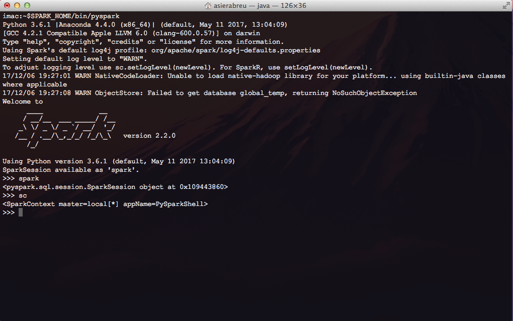
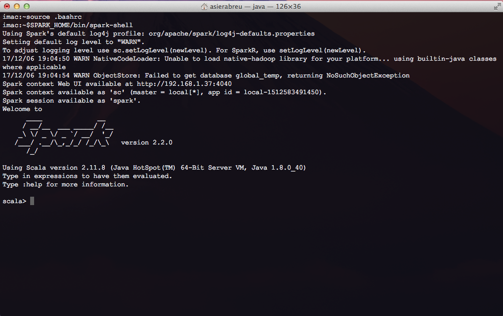

# Spark Course 

This repository contains all necessary inputs to run the course hands-on labs. 

## Repository Contents

* **Notebooks** : contains Jupyter Notebooks for the hands-on Labs
* **data** : contains input datasets for the labs
* **provision** : holds the bash provisioning scripts for the Virtual Machine
* **scripts** : useful scripts

## Required Software 

For the course hands-on sessions we will use (mostly) a virtual machine.
In order to create that vm you will first need to install the following software :

1. Install VirtualBox manager : [link](https://www.virtualbox.org/)

## Download and Start-Up a Virtual Machine

1. Download to your computer the 'spark-course' VM (.ova) file located under folder : vm of this repository
1. Start-up the VirtualBox manager and import the .ova virtual machine 
2. Boot-up this VM

The following software is pre-installed @ path : /usr/local/software/ inside the VM

   * Apache Spark v2.2.0
   * Anaconda (Python) v3.6
   * Apache Zeppelin v0.7.3

Now , do test the installation (see next).

## Test Installation

Start up the pyspark shell by typing **in the VM you just logged into**

```
$SPARK_HOME/bin/pyspark --master local[*]
```

You should see a PySpark shell appearing looking like this:



Start up a Scala spark shell
```
$SPARK_HOME/bin/spark-shell --master local[*]
```

You should see a Scala shell appearing looking like this:



## Virtual Cluster Start-up (Advanced)

1. Checkout the git repository to your computer
2. Go to the checked out directory
3. Download required course software 
4. Boot-up the Virtual Cluster
5. Login to the Virtual Cluster

```
git clone https://github.com/asierabreu/spark-course
cd spark-course
./scripts/download_sw.sh
vagrant up 
*now wait for cluster to be created and provisioned (~20 min)*
```

The following software will have been installed @ path : /usr/local/software/ (in the VM)

 * Apache Spark v2.2.0
 * Anaconda (Python) v3.6
 * Apache Zeppelin v0.7.3  

5. Login to the master VM and setup password-less access between cluster machines

```
vagrant ssh master
ssh-keygen -t rsa (and press enter to all prompts)
cat .ssh/id_pub.rsa >> .ssh/authorized_keys
ssh-copy-id ubuntu@driver ( and provide ubuntu password located under .vagrant.d/boxes/ubuntu-VAGRANTSLASH-xenial64/20171221.0.0/virtualbox/Vagrantfile)
ssh-copy-id ubuntu@slave1 ( " )
ssh-copy-id ubuntu@slave2 ( " ) 
$SPARK_HOME/sbin/start-all.sh ( spins-up spark master and slaves in standalone mode )
exit
```

## (Optional) Software Installation from scratch

Should you prefer to install all the software on your own computer follow these instructions:

1. Install Java [link](http://www.oracle.com/technetwork/java/javase/downloads/jdk8-downloads-2133151.html)
2. Install Anaconda [link](https://www.anaconda.com/download/#macos)
3. Install Apache Spark [link](https://spark.apache.org/downloads.html)
4. Install Apache Zeppelin [link](https://zeppelin.apache.org/download.html) 
5. Setup JAVA_HOME and SPARK_HOME
```
export JAVA_HOME=$Path_to_Your_Java_Installation
export SPARK_HOME=$Path_to_Your_Spark_Installation
export ZEPPELIN_HOME=$Path_to_Your_Zeppelin_Installation/zeppelin
export PATH=$CONDA_HOME/bin:$SPARK_HOME/bin:$SPARK_HOME/sbin:$ZEPPELIN_HOME/bin:$PATH
```
6. Test installation

Start-up pyspark shell
```
$SPARK_HOME/bin/pyspark --master local[*]
```

